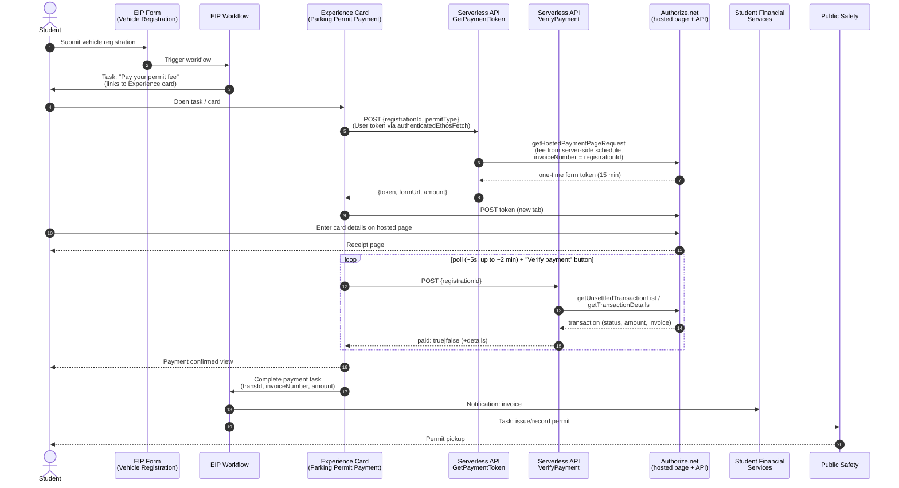

# MU Student Vehicle Permit — Payment Architecture

All-Ellucian implementation: Experience (extension card) + EIP / Intelligent
Processes (form, workflow, tasks) + Data Connect serverless APIs (Authorize.net
calls). No self-hosted middleware. Card data is entered only on Authorize.net's
hosted page (PCI SAQ-A).

## Workflow diagram

## Trust boundaries

- **Browser is never trusted.** The fee comes from the token pipeline's
  server-side schedule; payment confirmation comes only from the verify
  pipeline re-checking Authorize.net (`responseCode = 1` AND status
  captured/settled AND `invoiceNumber` matches the registration).
- **Secrets never leave Data Connect.** The Authorize.net Login ID /
  Transaction Key live as sensitive persistent pipeline parameters.
- **User token (`authType: "oauth"`)** on both pipelines: Experience
  authenticates the student; pipelines receive `context['user.id']` (Ethos
  person GUID) for optional ownership checks.

## Components in this repo

| Path | Component |
|---|---|
| `MU_ParkingPermit_GetPaymentToken_v1_0_0.serverless.json` | Data Connect serverless API — mints Accept Hosted token |
| `MU_ParkingPermit_VerifyPayment_v1_0_0.serverless.json` | Data Connect serverless API — authoritative payment check |
| `extension/` | Experience extension card (merge into Ellucian's extension template) |
| `server.js`, `accept-hosted.js`, `eip-client.js`, `public/` | Earlier standalone-Node implementation of the same flow — superseded by the above, kept for reference |

## Known limits / go-live items

1. Verify-by-search only sees **unsettled** transactions (pre nightly batch).
   Students verifying right after payment is the normal case; provide a staff
   lane (manual task completion) for stragglers, or store the transId.
2. Real **fee schedule** goes in the token pipeline's `Build Token Request`
   segment.
3. The workflow task-completion call from the card/workflow (step 14) is
   configured in the Workflow designer (external task), not in this repo.
4. Cash/check payers: Public Safety completes the task manually.
