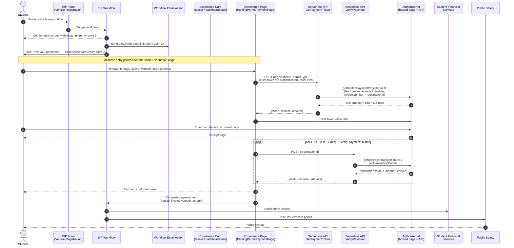

# MU Student Vehicle Permit — Payment Architecture

All-Ellucian implementation: Experience (extension page + teaser card) + EIP /
Intelligent Processes (form, workflow, tasks, email) + Data Connect serverless
APIs (Authorize.net calls). No self-hosted middleware. Card data is entered only
on Authorize.net's hosted page (PCI SAQ-A).

## Entry points for the student

Three paths all lead to the same Experience payment page
(`…/ParkingPermitPaymentPage/?reg=<registrationId>&permit=<permitType>`).

| # | Entry point | How | Pre-fills form? |
|---|---|---|---|
| 1 | **Form confirmation screen** | Workflow confirmation message contains the deep link | Yes (`?reg=` + `&permit=`) |
| 2 | **Workflow email** | Native EIP email action; body contains the same deep link | Yes |
| 3 | **Experience task + notification** | EIP task links to the ParkingPermitPaymentCard, which opens the page | No — student enters reg ID if absent |

Deep-link URL shape (tenant-specific; fill in the bracketed parts):
```
https://experience.elluciancloud.com/<tenant>/page/<account>/Methodist University/MU Parking Permit Payment/ParkingPermitPaymentPage/?reg=REG-12345&permit=full-year
```

Entry points 1 and 2 pre-fill the Registration ID and permit type so the
student lands directly on "Pay with card". Entry point 3 (dashboard task) shows
the teaser card, which opens the same page without query params, so the fields
are editable.

## Workflow diagram



## Trust boundaries

- **Browser is never trusted.** The fee comes from the token pipeline's
  server-side schedule; payment confirmation comes only from the verify
  pipeline re-checking Authorize.net (`responseCode = 1` AND status
  captured/settled AND `invoiceNumber` matches the registration).
- **Secrets never leave Data Connect.** The Authorize.net Login ID /
  Transaction Key live as sensitive persistent pipeline parameters.
- **User token (`authType: "oauth"`)** on both pipelines: Experience
  authenticates the student; pipelines receive `context['user.id']` (Ethos
  person GUID) for optional ownership checks.
- **Deep-link params are display-only.** `?reg=` pre-fills the Registration ID
  field but the server re-validates it against the Authorize.net invoice number;
  a tampered `reg` param produces no matching transaction.

## Components in this repo

| Path | Component |
|---|---|
| `MU_ParkingPermit_GetPaymentToken_v1_0_0.serverless.json` | Data Connect serverless API — mints Accept Hosted token |
| `MU_ParkingPermit_VerifyPayment_v1_0_0.serverless.json` | Data Connect serverless API — authoritative payment check |
| `extension/src/cards/ParkingPermitPayment.jsx` | Experience teaser card (shown in dashboard task list) |
| `extension/src/page/ParkingPermitPaymentPage.jsx` | Experience page — full payment UI; reads `?reg=` + `?permit=` from URL |
| `extension/extension.js` | Extension manifest — registers card + page, `pageRoute` wiring |

## EIP workflow configuration notes

### Entry point 1 — Form confirmation message
In the EIP Form designer, add a completion message such as:

> "Your registration has been submitted. Pay your permit fee here:
> https://experience.elluciancloud.com/\<tenant\>/page/\<account\>/Methodist University/MU Parking Permit Payment/ParkingPermitPaymentPage/?reg={{registrationId}}&permit={{permitType}}"

Use the workflow variable tokens for `registrationId` and `permitType`.

### Entry point 2 — Workflow email action
Add an **Email** action to the workflow after form submission:

- **To:** student email (from `context['user.email']` or form field)
- **Subject:** "Action required: Pay your MU parking permit fee"
- **Body:** Include the same deep link with `?reg=` and `&permit=` tokens.

No custom code required — this is a native EIP workflow action.

### Entry point 3 — Experience task / notification
The EIP workflow assigns an external task to the student. Experience surfaces
this as both a notification (bell icon) and a task card. The card's `pageRoute`
wires the "Pay now" button to the payment page.

## Known limits / go-live items

1. Verify-by-search only sees **unsettled** transactions (pre nightly batch).
   Students verifying right after payment is the normal case; provide a staff
   lane (manual task completion) for stragglers, or store the transId.
2. Real **fee schedule** goes in the token pipeline's `Build Token Request`
   segment.
3. The workflow task-completion call from the page/workflow (last step) is
   configured in the Workflow designer (external task), not in this repo.
4. Cash/check payers: Public Safety completes the task manually.
5. **Deep-link URL** — replace `<tenant>` and `<account>` with your
   Experience tenant slug and account ID before publishing the form message
   and email template.
